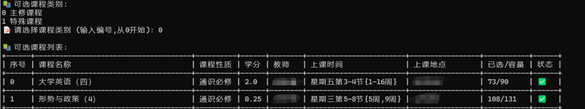

# XkTool

  

> 📌 **声明**：选课脚本Demo，仅支持自用，禁止用于商业用途或其他非法用途，使用本程序导致的任何问题由使用者自行承担。

---------------------------------------------------------------------------------------------------------------------------------------

## 功能列表

- [x] 支持自动获取` xkkz_id`、`kklxdm`，支持动态获取可选课程类别
- [x] 支持课程筛选，如课程名称，课程归属，上课时间，是否有余量筛选
- [x] 支持自动选择最优服务器及手动选择服务器
- [x] 支持自动使用保存的cookie登录，无需反复登录
- [x] 支持请求速度的控制
- [x] 支持已选课程查询
- [x] 支持已选课程退课

> 📌 **注意**：
>
> ​	本脚本**仅适用于选课**，而非抢课，旨在**模拟用户选课**，较浏览器会少加载些前端资源，速度稍快一些，**具体速度还是以服务器响应为准**，其他请求和浏览器**保持一致**。

## 使用教程

### 方法一

- 在[Releases](https://github.com/c0yt/xkTool/releases/tag/xkTool)中下载打包好的exe文件(exe可能会被误报，运行不了请关闭杀软后重试)

- 配置url.txt，即教务系统网址，支持填写多个url，每行一个，参考示例：

  ```python
  http://xxx.xx.xx.xx
  http://jwxt.example1.edu.cn
  http://jwxt.example2.edu.cn
  ```

- 双击运行程序

### 方法二

- 环境依赖：Python 3.x，Windows

- 安装环境

  ```bash
  pip install -r requirements.txt
  ```

- 配置url.txt，即教务系统网址，参考示例：

  ```python
  http://xxx.xx.xx.xx
  http://example1.edu.cn
  http://example2.edu.cn
  ```

- 运行程序

  ```python
  python main.py
  ```

## 修改建议

- 参数说明

  - 必修课-必要参数

    ```json
    rwlx:1
    xkly:1
    zyh_id:1103
    njdm_id:2024
    bh_id:24xxxxx
    xkxnm:2024
    xkxqm:12
    kklxdm:01	// 控制选课类别，01代表必修课
    kspage:1
    jspage:2000
    ```

  - 特殊课程-必要参数

    ```json
    xqh_id:1
    jg_id:11
    zyfx_id:wfx
    njdm_id:2024
    bh_id:24xxxxx
    xbm:1
    xslbdm:09
    mzm:01
    xz:4
    ccdm:3
    xsbj:xxxxxxxxx
    xkxnm:2024
    xkxqm:12
    kklxdm:09	// 控制选课类别，09代表特殊课程
    kspage:1
    jspage:10
    // 相较于必修课程，需加参数 mzm，xz，jg_id，并修改kklxdm
    // kklxdm：01 > 必修课程， 10 > 选修课程， 09 > 特殊课程	<体育课还未测试>
    ```

  - 筛选参数

    - 课程名称

      ```json
      filter_list[0]:xxxx	// 筛选课程名称，比如高等数学
      ```

    - 上课时间

      ```json
      sksj_list[0]:3	// 筛选上课星期，比如星期三=3
      ```

    - 课程归属

      ```json
      // 课程归属编号，不同学校不一样，请自行测试并修改
      kcgs_list[0]=1，人文社会科学
      kcgs_list[0]=2，自然科学与技术
      kcgs_list[0]=3，艺术与审美
      kcgs_list[0]=7，创新创业
      ```

    - 是否余量

      ```json
      yl_list[0]:1	// 筛选是否有余量 1代表有，0代表没有
      ```

  > 不同学校需要的参数不一样，建议自行测试修改

## 运行效果



## 参考项目

> 特别鸣谢以下大佬的项目：

- [psychocosine](https://github.com/psychocosine)大佬的开源项目[GXU_Spider](https://github.com/psychocosine/GXU_Spider)

- [shaxiu](https://github.com/shaxiu)大佬的开源项目[ZF_API](https://github.com/shaxiu/ZF_API)

